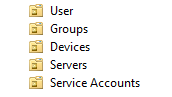
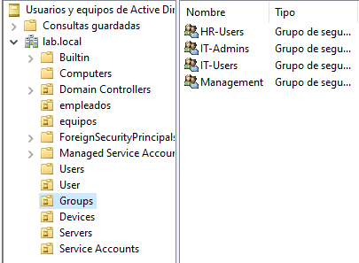
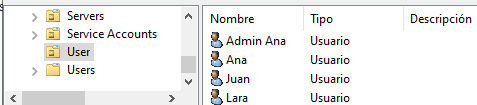
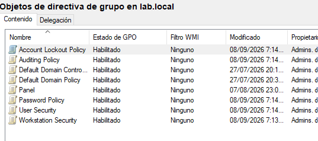
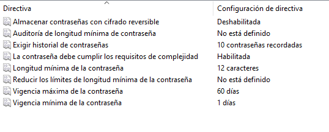
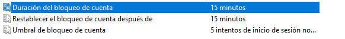
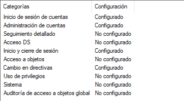
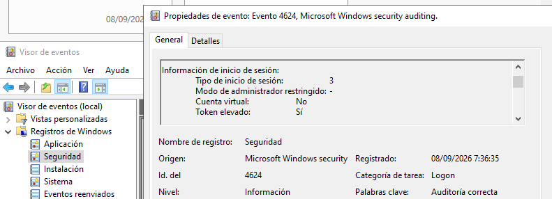

# Phase 4 — Windows Security & Active Directory

## Overview

This phase focuses on securing and organizing the Windows Active Directory environment.

The objective is to move from a functional Active Directory deployment to a more structured and security-oriented enterprise environment, applying principles such as:

* Least privilege
* Role-based access control
* Account separation
* Group Policy management
* Secure authentication
* Auditing and logging
* Active Directory hardening

The work is performed primarily on **DC01**, with policies and configurations being validated from the Windows 11 domain client.

---

## Objectives

* Design a structured Active Directory organizational model.
* Create security groups based on roles and responsibilities.
* Separate standard user accounts from administrative accounts.
* Apply the principle of least privilege.
* Configure Group Policy Objects (GPOs).
* Implement password and account lockout policies.
* Configure Windows security auditing.
* Analyze security-related Windows Event Logs.
* Improve the security posture of the Active Directory environment.
* Document configuration decisions, verification procedures, and troubleshooting.

---

## Active Directory Structure

The domain is organized using dedicated Organizational Units (OUs):

```text
LAB.LOCAL
│
├── User
├── Groups
├── Devices
├── Servers
└── Service Accounts
```

The default Active Directory containers are kept intact. The custom OUs are used to provide a dedicated administrative structure for the lab.

### User

Contains standard domain user accounts.

### Groups

Contains security groups used to organize permissions according to roles.

### Devices

Contains domain-joined client devices.

### Servers

Reserved for server objects that require dedicated administrative policies.

### Service Accounts

Reserved for accounts used by services and applications rather than interactive users.

### Screenshot



---

## Security Groups

Security groups are used as the primary mechanism for assigning permissions and access.

Initial groups:

```text
Groups
│
├── IT-Admins
├── IT-Users
├── HR-Users
└── Management
```

### Group Design

| Group        | Purpose                                                 |
| ------------ | ------------------------------------------------------- |
| `IT-Admins`  | Administrative personnel responsible for infrastructure |
| `IT-Users`   | Standard IT users                                       |
| `HR-Users`   | Human Resources users                                   |
| `Management` | Management users                                        |

Groups are preferred over assigning permissions directly to individual users.

This provides a more scalable model:

```text
User
  ↓
Security Group
  ↓
Permissions
```

Administrative privileges will be assigned deliberately rather than automatically granting broad domain-level privileges.

### Screenshot



---

## User Accounts

User accounts are separated according to their purpose.

Standard accounts are intended for normal daily activities, while administrative accounts are used only when elevated privileges are required.

Example:

```text
User
│
└── ana
```

Administrative access should use a separate privileged account where appropriate:

```text
User
│
├── ana
└── admin-ana
```

This separation reduces the exposure of privileged credentials during normal activities.

### Security Principles

* Avoid using privileged accounts for everyday tasks.
* Assign permissions through security groups.
* Follow the principle of least privilege.
* Avoid unnecessary membership in highly privileged groups.
* Keep service accounts separate from human accounts.

### Screenshot



---

# Group Policy

Group Policy is used to centrally manage security settings across domain-joined Windows systems.

The following policies will be developed during this phase:

```text
Group Policy
│
├── Workstation Security
├── User Security
├── Password Policy
├── Account Lockout Policy
└── Auditing Policy
```

The policies will be applied to the appropriate OUs rather than configuring every workstation individually.

---

## Workstation Security

A dedicated workstation security policy will be used to establish a baseline for domain-joined Windows clients.

Potential controls include:

* Security configuration
* Local security restrictions
* User account controls
* Windows security settings
* Administrative restrictions

The Windows 11 domain client will be used to verify that the policies are correctly applied.

### Verification

The effective Group Policy configuration can be inspected from the Windows client using:

```powershell
gpresult /r
```

and, when required:

```powershell
gpresult /h gpresult.html
```

### Screenshot



---

# Password Policy

The domain password policy will be configured to establish appropriate authentication requirements.

The policy will be evaluated in terms of:

* Minimum password length
* Password complexity
* Password history
* Maximum password age
* Minimum password age
* Reversible encryption

The final values will be documented together with the security rationale behind them.

### Screenshot



---

# Account Lockout Policy

An account lockout policy will be configured to reduce the impact of repeated failed authentication attempts.

The policy will define:

* Account lockout threshold
* Account lockout duration
* Reset counter after failed attempts

The configuration will be tested using a controlled lab account.

The goal is to understand both the security benefits and the operational implications of account lockout policies.

### Screenshot



---

# Auditing

Windows security auditing will be configured to generate useful security events.

The audit configuration will focus on activities such as:

* Successful logons
* Failed logons
* Account management
* Group membership changes
* User creation
* User deletion
* Privileged operations
* Policy changes

The objective is not simply to generate logs, but to create an environment where security-relevant activity can be investigated.

### Event Viewer

Security events can be inspected through:

```text
Event Viewer
└── Windows Logs
    └── Security
```

### Screenshot



---

# Security Event Analysis

After auditing is enabled, security events will be generated and investigated from the Windows Event Viewer.

The investigation will focus on understanding:

```text
Event
  ↓
Event ID
  ↓
Account
  ↓
Timestamp
  ↓
Action
  ↓
Security interpretation
```

Examples of events to investigate include:

* Successful authentication
* Failed authentication
* Account changes
* Group membership changes
* Privileged activity

The purpose of this section is to establish the foundations required for the future **Monitoring & SIEM** phase.

### Screenshot



---

# Active Directory Hardening

The final part of the phase focuses on improving the overall security posture of the domain.

The hardening process will be based on:

### Least Privilege

Users and administrators should receive only the permissions required for their responsibilities.

### Privileged Account Separation

Administrative accounts should be separated from normal user accounts.

### Group-Based Permissions

Permissions should be assigned through security groups whenever possible.

### Authentication Security

Password and account lockout policies should provide a reasonable balance between security and usability.

### Auditing

Security-relevant activity should generate events that can later be investigated.

### Administrative Control

Highly privileged groups such as `Domain Admins` should not be used unnecessarily.

---

# Verification

Each security control will be verified after configuration.

The verification process will include:

```text
Configuration
     ↓
Apply policy
     ↓
Force / wait for Group Policy update
     ↓
Verify client configuration
     ↓
Generate controlled test event
     ↓
Inspect resulting security event
     ↓
Document result
```

Useful commands include:

```powershell
gpupdate /force
```

```powershell
gpresult /r
```

and:

```powershell
whoami /groups
```

---

# Troubleshooting

Problems encountered during the phase will be documented here.

Each troubleshooting entry should contain:

```text
Problem
    ↓
Symptoms
    ↓
Investigation
    ↓
Root cause
    ↓
Solution
    ↓
Verification
```

This section will be updated as issues are encountered during implementation.

---

# Screenshots

The phase will contain selected screenshots showing the important configuration and verification points:

```text
screenshots/
├── 01-ad-structure.png
├── 02-ad-security-groups.png
├── 03-ad-users.png
├── 04-gpo-structure.png
├── 05-password-policy.png
├── 06-account-lockout.png
├── 07-auditing.png
└── 08-security-events.png
```

Screenshots are intended as evidence of the implemented configuration rather than a complete record of every administrative action.

Sensitive information such as passwords, authentication tokens, private keys, or unnecessary personal information must not be included.

---

# Phase Deliverables

At the end of this phase, the lab should provide:

* Structured Active Directory OUs
* Role-based security groups
* Separated standard and administrative accounts
* Centralized Group Policy management
* Password policy
* Account lockout policy
* Windows security auditing
* Security event investigation
* Documented Active Directory hardening
* Reproducible configuration and verification procedures

---

# Roadmap

```text
Phase 1 — Network Foundation
        ↓
Phase 2 — Firewall & Network Security
        ↓
Phase 3 — IDS/IPS
        ↓
Phase 4 — Windows Security & Active Directory
        ↓
Phase 5 — Monitoring & SIEM
        ↓
Phase 6 — Network Segmentation
        ↓
Future — Proxmox Infrastructure
```

Phase 4 provides the Windows security and Active Directory foundation required for the later **Monitoring & SIEM** phase.

---

# Status

**In Progress**

The phase is implemented incrementally. Configuration, verification, screenshots, and troubleshooting notes are added as each component is completed.
